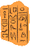
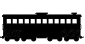
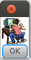

Bitmaps
=======

Built-in Bitmaps
----------------

To get you started quickly, a number of bitmap images from
Stephen Bloch's book *Picturing Programs* are included. These are:

* ``Book`` |Book|
* ``Calendar`` |Calendar| 
* ``Glyphs`` |Glyphs|
* ``Hacker`` |Hacker|
* ``StickPerson`` |StickPerson|
* ``TrainCar`` |TrainCar|
* ``TrainEngine`` |TrainEngine|

If you're using the normal console, you won't see the pretty images when you
type these::

    scala> Hacker
    res0: net.toddobryan.image.Bitmap = Hacker

However, you can see the image by calling the ``display()`` method on it. This
method will create a dialog box with the image inside::

    scala> Hacker.display()

will give you something like

|HackerDialog|

Either click OK or press return to close the dialog box and get back to your
console.

Bitmaps from Files
------------------

If you'd like to use your own bitmaps, you can load an image from the
filesystem. 

Suppose you've saved this lovely image of the letter 'H' |H| to the same 
directory as your project with the name `H.png`. You can access it
with::

    scala> Bitmap("H.png")
    res1: net.toddobryan.image.Bitmap = Bitmap("H.png")

You can save it in a ``val`` and display it, just like the built-in images::

    scala> val h: Image = Bitmap("H.png")
    h: net.toddobryan.image.Image = Bitmap("H.png")

    scala> h.display()

should show you a nice dialog box with a picture of that 'H'. Of course,
trying to load an image from a file that doesn't exist (or that you
misspelled) will cause an error.

Bitmaps from the Web
--------------------

You can also grab images from the internet, if you know their URL. For
example, to grab that lovely 'H' from where I found it on the WikiMedia site,
you do::

    scala> val netH: Image = Bitmap.fromUrl("http://upload.wikimedia.org/wikipedia/commons/a/a2/H.png")
    netH: net.toddobryan.image.Image = Bitmap.fromUrl("http://upload.wikimedia.org/wikipedia/commons/a/a2/H.png")
    
and then::

    scala> netH.display()

should show you the same image.

Any projects that include ``Bitmap.fromUrl(...)`` images will only work 
if you're connected to the internet. For that reason, it might be worth it
to save image files into your project.

