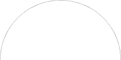

Portions of Circles and Ellipses
================================

Arcs
----

An arc is a portion of the outline of a circle or ellipse. You can draw an arc
starting at any angle and have it extend in the positive (counter-clockwise)
or negative (clockwise) direction as little or as much as you'd like.

::

    CircularArc(paint: Paint, radius: Double, start: Angle, extent: Angle): Image
    CircularArc(pen: Pen, radius: Double, start: Angle, extent: Angle): Image
    EllipticalArc(paint: Paint, width: Double, height: Double, start: Angle, extent: Angle): Image
    EllipticalArc(pen: Pen, width: Double, height: Double, start: Angle, extent: Angle): Image
    
Drawing an arc requires four kinds of information:

* ``paint`` or ``pen``—the color or color and size of the segment.
* ``radius`` or ``width`` and ``height``—the size of the whole circle or
  ellipse that this arc is part of. Note that circle uses radius, but
  ellipse uses the whole width and height, so a circle of radius 25
  would be equivalent to an ellipse with width and height of 50.
* ``start``—the angle at which the arc begins
* ``extent``—the angle that the resulting arc sweeps out

Here are some examples::

    scala> CircularArc(Color.Black, 100, 0.degrees, 180.degrees)
    
|CircularArc-Black-100-0-180|

::

    scala> EllipticalArc(Pen(Color.Magenta, 3), 200, 100, -90.degrees, -45.degrees)
    
|EllipticalArc-Magenta3-200-100-neg90-neg45|


CircularSector(paint: Paint, radius: Double, start: Angle, extent: Angle): Image
CircularSegment(paint: Paint, radius: Double, start: Angle, extent: Angle): Image
`````````````````````````````````````````````````````````````````````````````````

For all of these object's `apply()` methods, the first and second arguments
are just what you'd expect. The third and fourth arguments represent the angle
at which the arc, sector, or segment should begin, and the angle length of the
arc it cuts off. Both the start angle and the size of the angle can be positive
or negative.

A `CircularSector` looks like a pie wedge and a `CircularSegment` is what you get
when you connect the ends of an arc and fill in the area. Currently, there's
no way to draw the outline version of these shapes, unless you draw the lines and
arcs individually, but a future version may fix that.

```scala
```   
  
```scala
scala> CircularSector(Color.LimeGreen, 50, (math.Pi / 4).radians, (math.Pi/ 2).radians)
```  
  
```scala
scala> CircularSegment(Color.Violet, 100, -30.degrees, 100.degrees)
```  


### Ellipse Pieces

```scala
EllipticalSector(paint: Paint, width: Double, height: Double, start: Angle, extent: Angle): Image
EllipticalSegment(paint: Paint, width: Double, height: Double, start: Angle, extent: Angle): Image
``````````````````````````````````````````````````````````````````````````````````````````````````

The elliptical arc, sector, and segment builders are similar to the circular versions.
Remember, however, that `width` and `height` represent the width and height of the whole
ellipse, not the radius (like with the circular versions), and not just the part of the 
ellipse that you're drawing.

```scala
```  
  
```scala
scala> EllipticalSector(Color.DeepPink, 100, 200, -45.degrees, 180.degrees)
```  

```scala
scala> EllipticalSegment(Color.LightCoral, 75, 100, 45.degrees, 90.degrees)
```  




