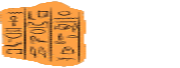
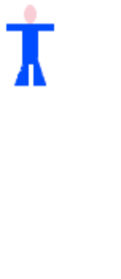

``Image`` Class
===============

The ``Image`` class is the superclass of all displayable shapes and bitmap 
images in the package. This means that the members of this class are key to
manipulating or combining any type of picture created in the package. You
can create interesting images just using the ``Bitmap`` images and the
methods you find in the ``Image`` class.

Properties
----------

::

    width: Int
    height: Int
 
Return the width and height of ``this`` image in pixels. For example::

    scala> Glyphs.width
    res4: Double = 45.0    
    scala> Glyphs.height
    res5: Double = 68.0

Utility Methods
---------------

::

    display(): Unit

Returns nothing, but displays a basic window with ``this`` image displayed.

::

    sameBitmapAs(img: Image): Boolean
    
Returns ``true`` or ``false``, depending on whether ``this`` image and
``img`` represent the same bitmap as one another. For example::

    scala> Hacker.sameBitmapAs(Glyphs)
    res0: Boolean = false

    scala> Hacker.rotate(180.degrees).sameBitmapAs(Hacker.flipVertical().flipHorizontal())
    res1: Boolean = true
    
Note that the second statement is true because rotating an image by 180 degrees is
equivalent to flipping it vertically and then horizontally. We'll see those methods
in a bit.
    
::

    saveAsDisplayed(filename: String): Unit
    
Returns nothing, but saves ``this`` image as a ``.png`` file with the given
filename. (If the filename doesn't end in ``.png``, it gets added.) An image
saved this way can be accessed by using ``Bitmap(filename)``.

Methods that Produce new ``Image``\ s
-------------------------------------

These methods usually take in numbers as parameters, but some have no 
parameters at all. They all return a new version of the image.

Cropping
^^^^^^^^

In image manipulation, cropping refers to cutting off a portion of an image.
There are methods that let you cut a given number of pixels off any side of
an image.

::

     cropLeft(numPixels: Double): Image
     cropRight(numPixels: Double): Image
     cropTop(numPixels: Double): Image
     cropBottom(numPixels: Double): Image

These methods return an image that is ``this`` image with a given number of 
pixels cut from the indicated edge. For example::

    scala> TrainEngine
    
|TrainEngine|

::

    scala> TrainEngine.cropLeft(87)
    
|TrainEngine-NoEngine|

::

    scala> TrainEngine.cropRight(45).display()
    
|TrainEngine-NoCar|

::

    scala> TrainEngine.cropTop(13).display()
    
|TrainEngine-NoSmoke|

You can also cut a rectangle out of the center of an image.

::

     crop(x: Double, y: Double, cropWidth: Double, cropHeight: Double): Image

This method returns an image that is a rectangle cut from ``this``
image, with a top corner at (x, y) and the given width and height. For example::

    scala> Glyphs
    
|Glyphs|

::

    scala> Glyphs.crop(26, 10, 13, 54)
    
|Glyphs-Column3|

Reflections
^^^^^^^^^^^

::

     flipHorizontal(): Image
     flipVertical(): Image

These methods return an image that is ``this`` image flipped, either
left to right or top to bottom. For example::

    scala> Book
    
|Book|

::

    scala> Book.flipHorizontal()
    
|Book-FlipH|

::

    scala> Calendar
    
|Calendar|

::

    scala> Calendar.flipVertical()
    
|Calendar-FlipV|

Rotations
^^^^^^^^^

The ``rotate`` method takes an ``Angle`` argument. If you've imported everything
from the ``org.dupontmanual.image`` package, then the easiest way to make an angle
is to call the ``degrees`` method on a number. There is also a ``radians`` method
if you'd prefer to work in radians. For example::

    scala> 45.degrees
    res2: org.dupontmanual.image.Angle = 45.000000 degrees

    scala> 90.degrees
    res3: org.dupontmanual.image.Angle = 90.000000 degrees

    scala> 90.degrees == (math.Pi / 2).radians
    res4: Boolean = true
    
To rotate an image counter-clockwise, use the ``rotate`` method with a positive angle.
Negative angles rotate in a clockwise direction::

     rotate(factor: Angle): Image

This method returns an image that is ``this`` image rotated by a given
``factor`` around the image's center::

    scala> StickPerson
    
|StickPerson|

::

    scala> StickPerson.rotate(90.degrees)
    
|StickPerson-90Clockwise|

::

    scala> StickPerson.rotate(-45.degrees)
    
|StickPerson-45CounterClockwise|

There's a whole :doc:`page <angles>` discussing ``Angle``\ s if you're curious about them.

Scaling
^^^^^^^

::

     scaleX(xFactor: Double): Image
     scaleY(yFactor: Double): Image

These methods return an image that is ``this`` image stretched by a given
factor either horizontally or vertically.

::

     scale(xFactor: Double, yFactor: Double): Image

This method returns an image that is ``this`` image scaled horizontally and 
vertically by the given factors. For example::

    scala> Glyphs
    
|Glyphs|

::

    scala> Glyphs.scaleX(2)
    
|Glyphs-ScaleX-2|

::

    scala> StickPerson
    
|StickPerson|

::

    scala> StickPerson.scaleY(3)
    
|StickPerson-ScaleY-3|

::

    scala> StickPerson.scale(2, 3)
    
|StickPerson-Scale-2-3|

Translation
^^^^^^^^^^^

::

     translate(x: Double, y: Double): Image

This method returns an image that is ``this`` image moved ``x`` pixels
right and ``y`` pixels down. Use negative numbers to translate
the image left and up.

TODO: examples

Adding Images Together
^^^^^^^^^^^^^^^^^^^^^^

::

    above(img: Image): Image
    
Creates a new ``Image``, which is ``this`` image vertically aboove ``img``.
The two ``Image``\ s are centered horizontally with respect to one another.

TODO: examples

::

    beside(img: Image): Image
    
Creates a new ``Image``, which is ``this`` image to the left of ``img``.
The two ``Image``\ s are centered vertically with respect to one another.

TODO: examples

Stacking Images
^^^^^^^^^^^^^^^

::

    stackOn(img: Image)
    slideUnder(img: Image)
    
Creates a new ``Image``, which is ``this`` image overlaid in front of ``img``.
The two ``Image``\ s are centered vertically and horizontally with respect
to one another. ``img1.stackOn(img2)`` is equivalent to
``img2.slideUnder(img1)``. The resulting image is as large as necessary to
contain both the front and back images.

TODO: examples

::

    def stackOn(img: Image, dx: Double, dy: Double): Image
    def slideUnder(img: Image, dx: Double, dy: Double): Image
    
Creates a new ``Image``, which is ``img`` overlaid in front of ``this`` image, but offset
``dx`` pixels to the right and ``dy`` pixels down from what it would be if the images were 
aligned at the center. (Use negative numbers to move the top image to the left or up.)
Note that ``img1.stackOn(img2, dx, dy)`` is equivalent to ``img2.slideUnder(img1, dx, dy)``
and that both move ``img1`` the given number of pixels in each direction. The resulting
image is as large as necessary to contain both the front and back images.

TODO: examples

::

    placeImage(img: Image, x: Double, y: Double): Image
    
Creates a new ``Image``, which is the result of placing the center of ``img`` at the
coordinate ``x`` pixels to the right and ``y`` pixels down from the top left corner
of this image. The resulting image is the same size as ``this`` image and any parts
of ``img`` that extend beyond that boundary will be cropped.

TODO: examples

Aligning Images
^^^^^^^^^^^^^^^

By default, the methods ``above``, ``beside``, ``stackOn``, and ``slideUnder`` use
the centers of the two images as reference points. Similarly, ``placeImage`` puts its
argument so that its center is at the given coordinates.

Sometimes, however, you'll want to align your images on points that are not the centers.
For that purpose, there are nine alignment values that you can use. They are:

+----------------------+------------------+-----------------------+
| ``Align.TopLeft``    | ``Align.Top``    | ``Align.TopRight``    |
+----------------------+------------------+-----------------------+
| ``Align.Left``       | ``Align.Center`` | ``Align.Right``       |
+----------------------+------------------+-----------------------+
| ``Align.BottomLeft`` | ``Align.Bottom`` | ``Align.BottomRight`` |
+----------------------+------------------+-----------------------+

::

    above(img: Image, xAlign: Align): Image
    
Creates a new ``Image``, which is ``this`` image vertically above ``img``.
The two images are aligned at their left edges, their centers, or their
right edges, depending on whether ``xAlign`` is ``Align.Left``, 
``Align.Center``, or ``Align.Right``. (If you use another value for
``xAlign``, the ``Top`` or ``Bottom`` portion is just ignored.)

TODO: examples

::

    beside(img: Image, yAlign: Align): Image
    
Creates a new ``Image``, which is ``this`` image to the left of ``img``.
The two images are aligned at their top edges, their centers, or their
bottom edges, depending on whether ``yAlign`` is ``Align.Top``, 
``Align.Center``, or ``Align.Bottom``. (If you use another value for
``yAlign``, the ``Left`` or ``Right`` portion is just ignored.)

TODO: examples

::

    def stackOn(img: Image, align: Align): Image
    def slideUnder(img: Image, align: Align): Image
    
Creates a new ``Image``, which is ``this`` image overlaid on top of ``img``.
The two ``Image``\ s are aligned so that the points indicated by the ``align``
value are directly on top of one another. In other words, if you choose
an ``align`` value of ``Align.BottomRight``, the bottom right corner of the 
two images will be on top of one another. ``img1.slideUnder(img2, align)``
is equivalent to ``img2.stackOn(img1, align)``.

TODO: examples 

::

    def stackOn(img: Image, align: Align, dx: Double, dy: Double): Image
    def slideUnder(img: Image, align: Align, dx: Double, dy: Double): Image
    
Creates a new ``Image``, which is ``this`` image overlaid in front of ``img``, aligned
according to ``align``, but with the front image offset ``dx`` pixels to the right and ``dy``
pixels down. (Use negative numbers for left and up.) Whether you use ``stackOn`` or
``slideUnder``, it is the front image that is moved the given number of pixels.

TODO: examples

::

    def placeImage(img: Image, align: Align, x: Double, y: Double): Image
    
Creates a new ``Image``, which is the result of overlaying ``img`` in front
of ``this`` image so that the point indicated by ``align`` is at the
location ``x`` pixels to the right and ``y`` pixels down from the top left
corner of ``this`` image. The resulting image is the same size as ``this`` image
and any part of ``img`` that extends outside the boundary is cropped off.

TODO: examples

.. |TrainEngine| image:: images/bitmaps/train-engine.png

.. |Glyphs| image:: images/bitmaps/hieroglyphics.png

.. |Book| image:: images/bitmaps/qbook.png

.. |Calendar| image:: images/bitmaps/calendar.png

.. |StickPerson| image:: images/bitmaps/stick-figure.png

