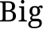
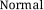
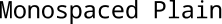
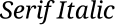

Text
====

No image library would be complete without the ability to draw text. Luckily,
creating a textual image is fairly easy, but if you want to control size,
color, style, and font, each extra bit of control makes the code just a
little bit more complicated. We'll begin with the easiest ways to make
text and continue to the more esoteric versions.

Default Font
------------

::

    Text(text: String): Image
    Text(paint: Paint, text: String): Image
    Text(size: Int, text: String): Image
    Text(paint: Paint, size: Int, text: String): Image
    
By default, all ``Text`` objects are black type, 18 points high, in a 
`serif <https://en.wikipedia.org/wiki/Serif>`_ font. If you're okay with
that, use the first expression to create a `Text` image::

    scala> Text("Hello")
    
|Hello|

To change just the color of the text, use the second form. The size
and style of the font will be the same, only the color will change::

    scala> Text(Color.Red, "Warning!")
    
|Warning|

If you want to change the size of the text, use the third form. Only the
size of the font will change; it will still be a black, serif font::

    scala> Text(36, "Big")
    
|Big|

::

    scala> Text(12, "Normal")
    
|Normal| 

Finally, the last form lets you alter both the color and size of the
text::

    scala> Text(Color.HotPink, 48, "Pink Power!!!")

|PinkPower|

::

    scala> Text(Color.Gray, 9, "quiet, please...")
  
|Quiet|

Fonts and Styles
----------------

If you don't like the default, serif font, a sans serif and a monospaced
font are also available. The advantage of these two fonts is that they
are available on every computer that runs the Java Virtual Machine, so
you can be guaranteed that they'll work.

You can also include any font installed on your operating system, but
if someone else tries to display your image and doesn't have the font,
they'll likely get an error.

Here are the expressions used to create a ``Font``::

    Font(name: BuiltIn, style: Style, size: Int)
    Font(name: String, style: Style, size: Int)
    
You have three choices for a ``BuiltIn`` font name: 

* ``Font.Serif``,
* ``Font.SansSerif``, and 
* ``Font.Monospaced``. 

If you decide instead to use an operating system font, you should 
provide the name of the font as a ``String``, for example, 
``"Times New Roman"`` or ``"Webdings"``. (Remember that using a ``String``
font name can lead to errors if you try to run your code on another machine.)

The possible values for ``Style`` are:

* ``Font.Plain``,
* ``Font.Bold``,
* ``Font.Italic``, and
* ``Font.BoldItalic``

Finally, you should pick a positive number for the ``size``. Obviously, sizes
that are too small or too large will be pretty much unreadable. With that in
mind, here are some sample images::

    scala> Text(Font(Font.SansSerif, Font.Plain, 24), "Sans Serif Plain")
    
|SansSerifPlain|

::

    scala> Text(Font(Font.Monospaced, Font.Plain, 24), "Monospaced Plain")
    
|MonospacedPlain|

::

    scala> Text(Font(Font.Serif, Font.Plain, 24), "Serif Plain")
    
|SerifPlain|

::

    scala> Text(Font(Font.Serif, Font.Bold, 24), "Serif Bold")
    
|SerifBold|

::

    scala> Text(Font(Font.Serif, Font.Italic, 24), "Serif Italic")
    
|SerifItalic|

::

    scala> Text(Font(Font.Serif, Font.BoldItalic, 24), "Serif Bold Italic")
    
|SerifBoldItalic|

::

    scala> Text(Color.Orange, Font("DejaVu Serif", Font.Plain, 36), "DejaVu Serif Plain")
    
|DejaVuSerifPlain|

::

    scala> Text(Color.Plum, Font("DejaVu Serif", Font.Italic, 36), "DejaVu Serif Italic")
    
|DejaVuSerifItalic|

